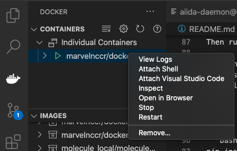

[](https://github.com/marvel-nccr/ansible-role-aiidalab/actions)
[](https://galaxy.ansible.com/marvel-nccr/aiidalab)
[](https://github.com/marvel-nccr/ansible-role-aiidalab/releases)

# Ansible Role: marvel-nccr.aiidalab

An ansible role that installs the [Materials Cloud](www.materialscloud.org) AiiDA Lab components.

The AiiDA Lab server can be launched either by running the `/usr/local/bin/aiida-aiidalab` executable in the terminal, or double-clicking on the AiiDa Lab desktop short-cut (when installed on a non-headless VM).

This role is dependent on the [marvel-nccr.aiida](https://github.com/marvel-nccr/ansible-role-aiida) role, for installing the initial aiida and jupyter environments,
and also nodejs should be installed independently.

## Installation

`ansible-galaxy install marvel-nccr.aiidalab`

## Role Variables

See `defaults/main.yml`

## Example Playbook

```yaml
- hosts: servers
  vars:
    aiida_venv: "${HOME}/.virtualenvs/aiida"
    aiida_venv_constraints: "${HOME}/.local/share/aiida/constraints.txt"
    aiida_jupyter_venv: "${HOME}/.virtualenvs/aiida"
  tasks:
  - name: Install nodejs 12.x
    include_role:
      name: geerlingguy.nodejs
    vars:
      nodejs_version: 12.x
      nodejs_install_npm_user: root
  - name: Install aiida
    include_role:
      name: marvel-nccr.aiida
  - name: Install AiiDA Lab
    include_role:
      name: marvel-nccr.aiidalab
    vars:
      aiidalab_aiida_venv: "{{ aiidalab_aiida_venv }}"
      aiidalab_aiida_venv_constraints: "{{ aiida_venv_constraints }}"
      aiidalab_jupyter_venv: "{{ aiida_jupyter_venv }}"
```

Note: When building a Docker container, the variable `jupyter_ip: "0.0.0.0"` should be set, for `aiida-aiidalab` to correctly expose the port.

## Development and testing

This role uses [Molecule](https://molecule.readthedocs.io/en/latest/#) and [Docker](https://www.docker.com/) for tests.

After installing [Docker](https://www.docker.com/):

Clone the repository into a package named `marvel-nccr.aiidalab` (the folder must be named the same as the Ansible Galaxy name)

```bash
git clone https://github.com/marvel-nccr/ansible-role-aiidalab marvel-nccr.aiidalab
cd marvel-nccr.aiidalab
```

Then run:

```bash
pip install -r requirements.txt  # Installs molecule
molecule test  # runs tests
```

or use tox (see `tox.ini`):

```bash
pip install tox
tox
```

To manually test the created docker container, first run:

```bash
tox converge
```

This will run the ansible role, leaving the container running.
The recommended way to interact with the container is then to use the [VS Code Docker extension](https://marketplace.visualstudio.com/items?itemName=ms-azuretools.vscode-docker).
Using this you can then attach a visual studio code instance:



Inside the container run `aiida-jupyterlab` or `aiida-aiidalab`, and you will be able to access the supplied URLs from your local browser.

When you are finished with the container, destroy the container with:

```bash
tox destroy
```

## Code style

Code style is formatted and linted with [pre-commit](https://pre-commit.com/).

```bash
pip install pre-commit
pre-commit run -all
```

## Deployment

Deployment to Ansible Galaxy is automated *via* GitHub Actions.
Simply tag a release `vX.Y.Z` to initiate the CI and release workflow.
Note, the release will only complete if the CI tests pass.

## License

MIT

## Contact

Please direct inquiries regarding Quantum Mobile and associated ansible roles to the [AiiDA mailinglist](http://www.aiida.net/mailing-list/).
